Answer the following questions and provide the SQL queries used to find the answer.

    
**Question 1: Which cities and countries have the highest level of transaction revenues on the site?**


SQL Queries:

*Cities with highest level of transaction revenues:*
```
SELECT 	a.city,
	SUM(CAST(
        (CAST(a.productprice AS NUMERIC)/ 1000000)*
        CAST(p.orderedquantity AS NUMERIC)AS NUMERIC)) 
        AS transactionrevenue,
	CASE
		WHEN city = 'not available in demo dataset' THEN 'City Unavailable'
		WHEN city = '(not set)' THEN 'City Unavailable'
		ELSE city
	END AS city1
FROM 	all_sessions a
JOIN 	sales_report s
		ON 		a.productsku = s.productsku
JOIN 	products p 
		ON 		s.restockingleadtime = p.restockingleadtime
GROUP BY a.city 
ORDER BY transactionrevenue DESC;
```

*Countries with highest level of transaction revenues:*
```
SELECT 	a.country,
	SUM(CAST(
        (CAST(a.productprice AS NUMERIC)/ 1000000)*
        CAST(p.orderedquantity AS NUMERIC)AS NUMERIC)) 
        AS transactionrevenue,
	CASE
		WHEN country = '(not set)' THEN 'Country Unavailable'
		ELSE country
	END AS country1
FROM 	all_sessions a
JOIN 	sales_report s
		ON 		a.productsku = s.productsku
JOIN 	products p 
		ON 		s.restockingleadtime = p.restockingleadtime
GROUP BY a.country 
ORDER BY transactionrevenue DESC;
```

Answer:

*Cities with highest level of transaction revenues:*

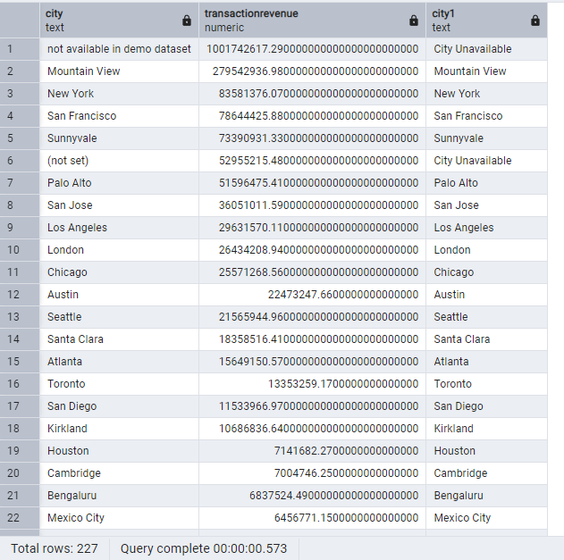

*Countries with highest level of transaction revenues:*

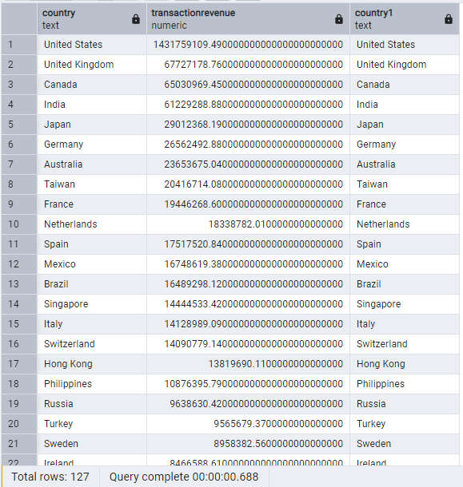

**Question 2: What is the average number of products ordered from visitors in each city and country?**


SQL Queries:

*Average number of products ordered from visitors in each city:*
```
SELECT  a.city, 
	AVG(CAST (s.total_ordered AS NUMERIC)) AS averageordered,
	CASE
		WHEN city = 'not available in demo dataset' THEN 'City Unavailable'
		WHEN city = '(not set)' THEN 'City Unavailable'
		ELSE city
	END AS city1
FROM    all_sessions a
JOIN    sales_report s
        ON  a.productsku = s.productsku
GROUP BY a.city
ORDER BY averageordered DESC;
```

*Average number of products ordered from visitors in each country:*
```
SELECT  a.country, 
	AVG(CAST (s.total_ordered AS NUMERIC)) AS averageordered,
	CASE
		WHEN country = 'not available in demo dataset' THEN 'City Unavailable'
		WHEN country = '(not set)' THEN 'City Unavailable'
		ELSE country
	END AS country1
FROM    all_sessions a
JOIN    sales_report s
        ON a.productsku = s.productsku
GROUP BY a.country
ORDER BY averageordered DESC;
```

Answer:

*Average number of products ordered from visitors in each city:*

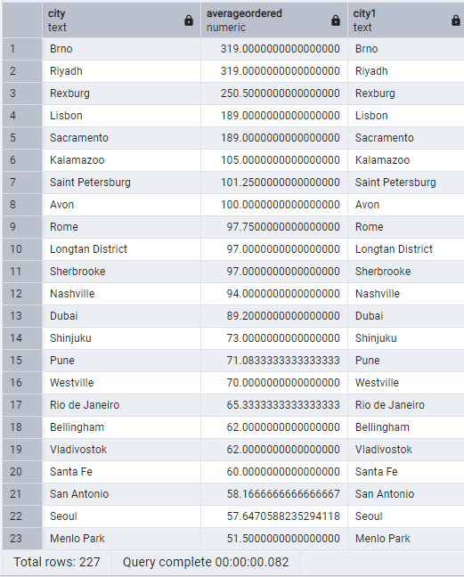

*Average number of products ordered from visitors in each country:*

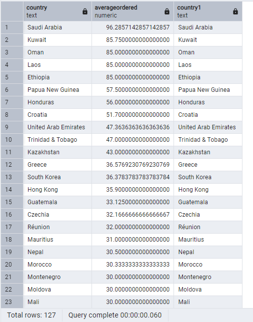


**Question 3: Is there any pattern in the types (product categories) of products ordered from visitors in each city and country?**


SQL Queries:

*Types (product categories) of products ordered from visitors in each city:*
```
SELECT  a.city, 
	    CAST(a.v2productcategory AS TEXT) AS producttypes, 
	    SUM(CAST(p.orderedquantity AS NUMERIC)) AS orderedquantity,
	    CASE
		    WHEN a.v2productcategory= '${escCatTitle}' THEN 'Cat'
		    ELSE a.v2productcategory
	    END AS producttypes1
FROM    all_sessions a
JOIN    products p
	    ON 	a.productsku = p.sku
WHERE   CAST(p.orderedquantity AS NUMERIC)<> 0 
            AND a.city<> 'not available in demo dataset' 
            AND a.city<> '(not set)' 
            AND a.v2productcategory<> '(not set)'
GROUP BY a.city, a.v2productcategory
ORDER BY producttypes1 ASC, orderedquantity DESC;
```

*Types (product categories) of products ordered from visitors in each country:*
```
SELECT 	a.country, 
	    CAST(a.v2productcategory AS TEXT) AS producttypes, 
	    SUM(CAST(p.orderedquantity AS NUMERIC)) AS orderedquantity,
	    CASE
		    WHEN a.v2productcategory= '${escCatTitle}' THEN 'Cat'
		    ELSE a.v2productcategory
	    END AS producttypes1
FROM    all_sessions a
JOIN    products p
	    ON 	a.productsku = p.sku
WHERE   CAST(p.orderedquantity AS NUMERIC)<> 0 
            AND a.country<> 'not available in demo dataset' 
            AND a.country<> '(not set)' 
            AND a.v2productcategory<> '(not set)'
GROUP BY a.country, a.v2productcategory
ORDER BY producttypes1 ASC, orderedquantity DESC;
```

Answer:

There are a few noteworthy patterns observed when viewing the results from the queries returning the types of products ordered from visitors in each country:
1) Almost all cities have home product types in the products ordered.
2) United states is the highest volume orders per product type for almost all categories listed indicating the United States is the higest consumer of ordered products from this particular site.
3) Significant volume of product types in 'Home' product types while other product types observed to be realtively limitedlimited or low in comparison.

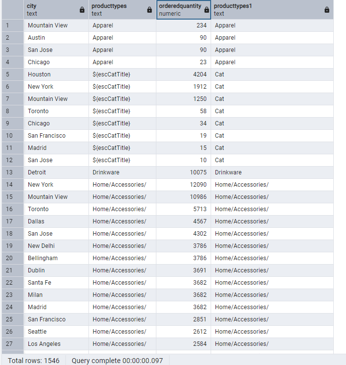

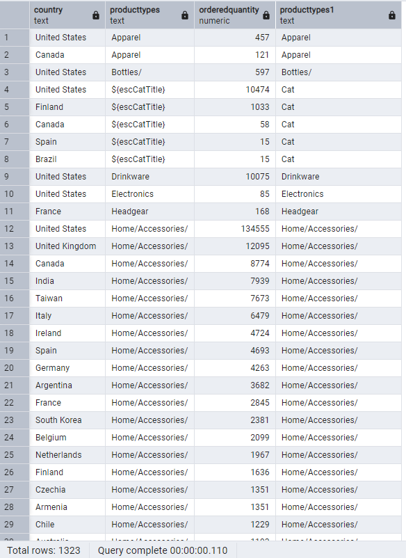

**Question 4: What is the top-selling product from each city/country? Can we find any pattern worthy of noting in the products sold?**


SQL Queries:

*Top-selling product from each city:*

```
WITH CTE as (
	SELECT  a.city, 
		    CAST(a.v2productname AS TEXT) AS productname, 
		    SUM(CAST(p.orderedquantity AS NUMERIC)) AS orderedquantity, 
		    ROW_NUMBER() OVER (PARTITION BY a.city ORDER BY SUM(CAST(p.orderedquantity AS NUMERIC)) DESC)AS RANK
	FROM    all_sessions a
	JOIN    products p
		    ON 	a.productsku = p.sku
	WHERE   CAST(p.orderedquantity AS NUMERIC)<> 0 
            AND a.city<> 'not available in demo dataset' 
            AND a.city<> '(not set)' 
            AND a.v2productcategory<> '(not set)'
	GROUP BY a.city, a.v2productname
	ORDER BY city ASC, orderedquantity DESC
)
SELECT city, productname, orderedquantity
FROM CTE
WHERE RANK = 1
ORDER BY city;
```
Extra Step: top selling product by ordered quantity to determine highest selling city: 

```
WITH CTE as (
	SELECT  a.city, 
		    CAST(a.v2productname AS TEXT) AS productname, 
		    SUM(CAST(p.orderedquantity AS NUMERIC)) AS orderedquantity, 
		    ROW_NUMBER() OVER (PARTITION BY a.city ORDER BY SUM(CAST(p.orderedquantity AS NUMERIC)) DESC)AS RANK
	FROM    all_sessions a
	JOIN    products p
		    ON 	a.productsku = p.sku
	WHERE   CAST(p.orderedquantity AS NUMERIC)<> 0 
            AND a.city<> 'not available in demo dataset' 
            AND a.city<> '(not set)' 
            AND a.v2productcategory<> '(not set)'
	GROUP BY a.city, a.v2productname
	ORDER BY city ASC, orderedquantity DESC
)
SELECT city, productname, orderedquantity
FROM CTE
WHERE RANK = 1
ORDER BY orderedquantity DESC;
```

*Top-selling product from each country:*

```
WITH CTE as (
	SELECT  a.country, 
		    CAST(a.v2productname AS TEXT) AS productname, 
		    SUM(CAST(p.orderedquantity AS NUMERIC)) AS orderedquantity, 
		    ROW_NUMBER() OVER (PARTITION BY a.country ORDER BY SUM(CAST(p.orderedquantity AS NUMERIC)) DESC)AS RANK
	FROM    all_sessions a
	JOIN    products p
		    ON 	a.productsku = p.sku
	WHERE   CAST(p.orderedquantity AS NUMERIC)<> 0 
            AND a.country<> 'not available in demo dataset' 
            AND a.country<> '(not set)' 
            AND a.v2productcategory<> '(not set)'
	GROUP BY a.country, a.v2productname
	ORDER BY country ASC, orderedquantity DESC
)
SELECT country, productname, orderedquantity
FROM CTE
WHERE RANK = 1
ORDER BY country;
```
Extra Step: top selling product by ordered quantity to determine highest selling country: 

```
WITH CTE as (
	SELECT  a.country, 
		    CAST(a.v2productname AS TEXT) AS productname, 
		    SUM(CAST(p.orderedquantity AS NUMERIC)) AS orderedquantity, 
		    ROW_NUMBER() OVER (PARTITION BY a.country ORDER BY SUM(CAST(p.orderedquantity AS NUMERIC)) DESC)AS RANK
	FROM    all_sessions a
	JOIN    products p
		    ON 	a.productsku = p.sku
	WHERE   CAST(p.orderedquantity AS NUMERIC)<> 0 
            AND a.country<> 'not available in demo dataset' 
            AND a.country<> '(not set)' 
            AND a.v2productcategory<> '(not set)'
	GROUP BY a.country, a.v2productname
	ORDER BY country ASC, orderedquantity DESC
)
SELECT country, productname, orderedquantity
FROM CTE
WHERE RANK = 1
ORDER BY orderedquantity DESC;
```

Answer:

Patterns worth noting in the products sold:
1) Significant representation of Google and YouTube products in the top rank for many cities 
2) Significant representation of YoutTibe products in the top rank for many countries 
3) Of all cities, Mountainview had the highest ordered quantity of all cities with the productname Nest Cam Indoor Security Camera - USA. 
4) Of all countries, United States had the highest ordered quantity of all countries with the productname Google Kick Ball.
5) Nest Cam Indoor Security Camera - USA and Google Kick Ball are top product names ordered for all cities. 
6) Google Kick Ball and Youtube Custom Decals are top product names ordered for all countries.

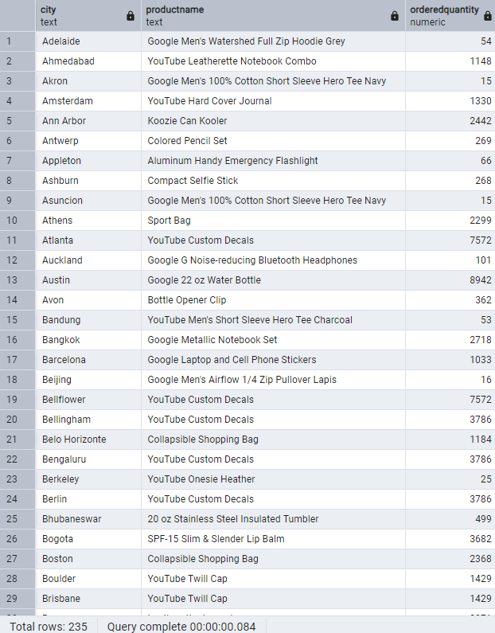

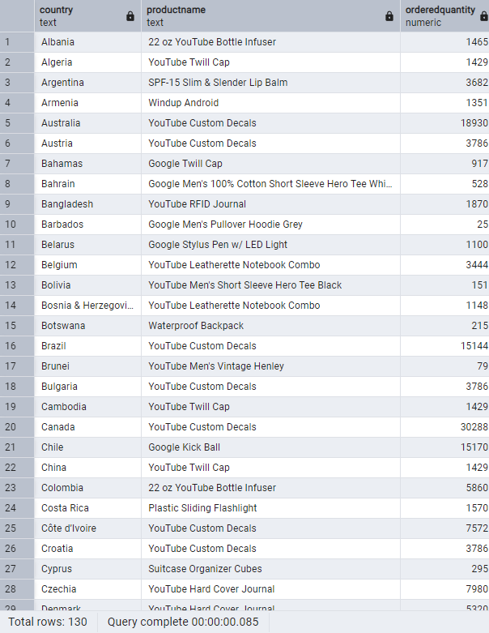

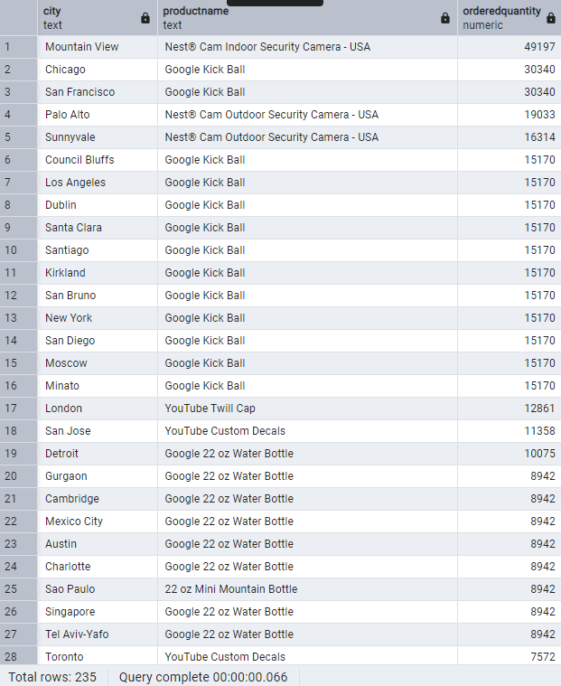

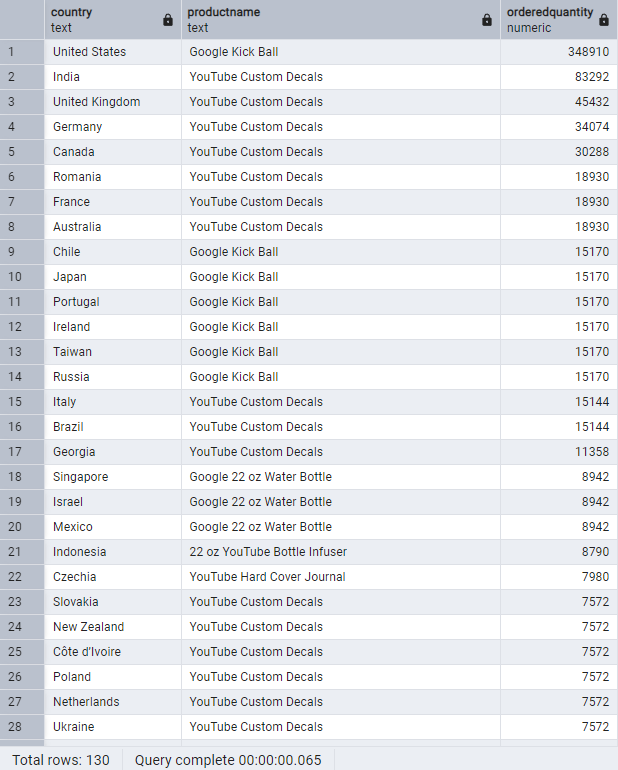


**Question 5: Can we summarize the impact of revenue generated from each city/country?**

SQL Queries:

*Impact revenue summary for each city:*
```
SELECT 	a.city,
		TO_CHAR(
            SUM(CAST((CAST(a.productprice AS NUMERIC)/ 1000000)*CAST(p.orderedquantity AS NUMERIC)AS NUMERIC)), '99999999999.00') AS impactrevenue,
		CASE
			WHEN city = 'not available in demo dataset' THEN 'City Unavailable'
            WHEN city = '(not set)' THEN 'City Unavailable'
			ELSE city
		END AS city1
FROM 	all_sessions a
JOIN 	sales_report s
		ON 		a.productsku = s.productsku
JOIN 	products p 
		ON 		s.restockingleadtime = p.restockingleadtime
GROUP BY a.city
ORDER BY impactrevenue DESC;

```

*Impact revenue summary for each country:*
```
SELECT 	a.country,
		TO_CHAR(
            SUM(CAST((CAST(a.productprice AS NUMERIC)/ 1000000)*CAST(p.orderedquantity AS NUMERIC)AS NUMERIC)), '99999999999.00') AS impactrevenue,
		CASE
			WHEN country = '(not set)' THEN 'Country Unavailable'
			ELSE country
		END AS country1
FROM 	all_sessions a
JOIN 	sales_report s
		ON 		a.productsku = s.productsku
JOIN 	products p 
		ON 		s.restockingleadtime = p.restockingleadtime
GROUP BY a.country
ORDER BY impactrevenue DESC;
```

Answer:

Yes, we can summarize the impact revenue from each city/country by generating the total revenue. The higher the revenue for a city/country, the assumption would be that there is a greater impact revenue. This would also depend on the overal revenue of a country. For example, if a country is quite small and has a signficant amount of revenue there may be a greater impact than a country that is vast with significant revenue also have the same significant amount of revenue. These additional considerations or parameters are not fully known or possible to determine in this dataset but we are able to generate a table the demonstrates revenue for each country is descending order. It can be observed that the United States is the highest impact revenue, given the limitations in data, and the city with the highest is actually unavailble. Given the volume of revenue in the unknown city, it can be assumed it is within the United States but unable to confirm. 

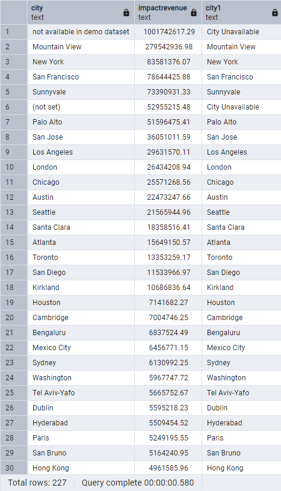

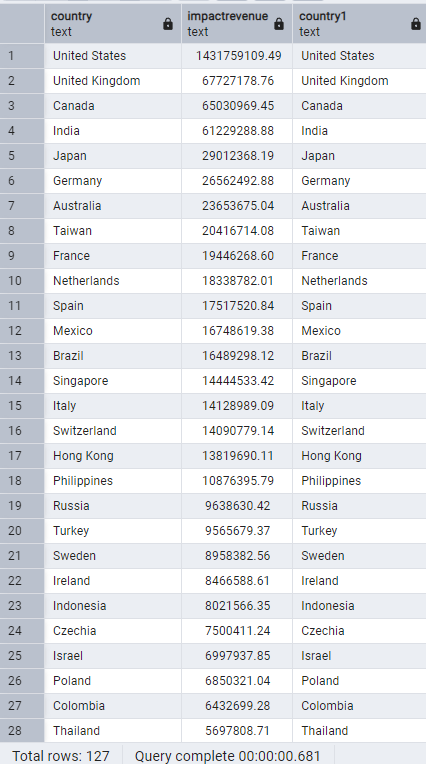


